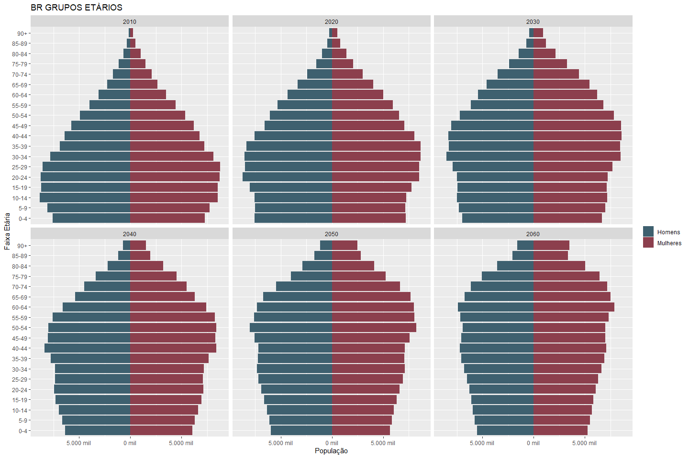
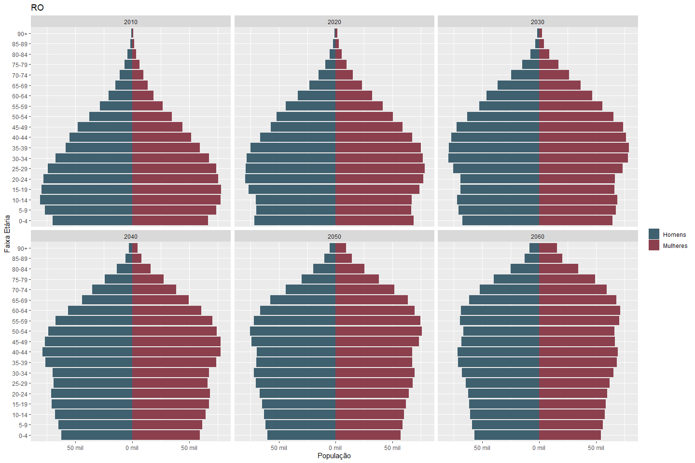
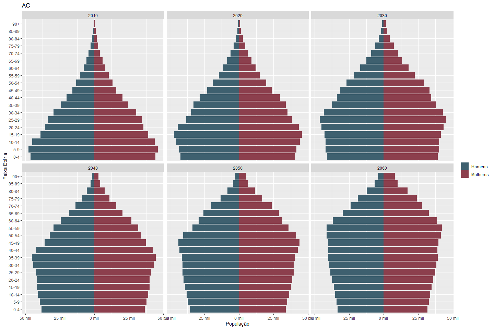
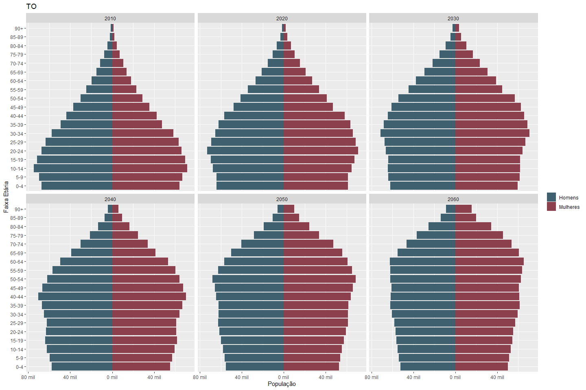
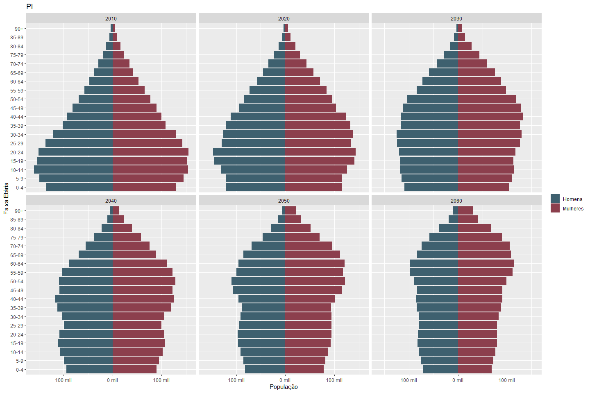
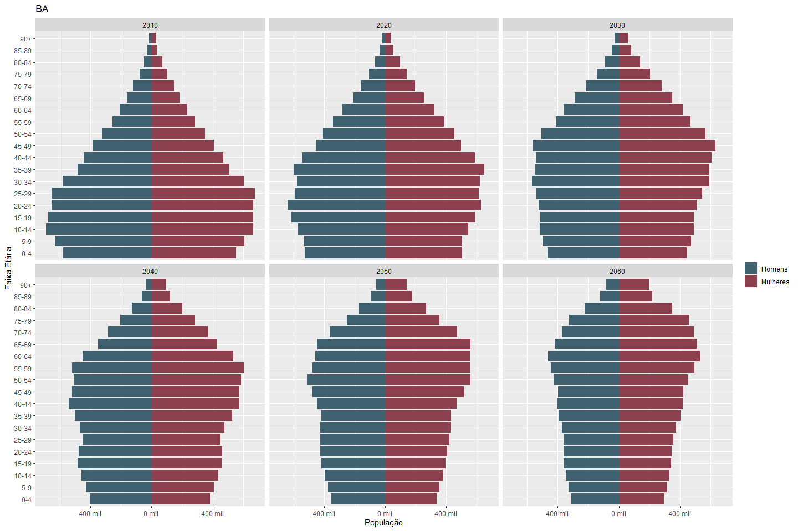
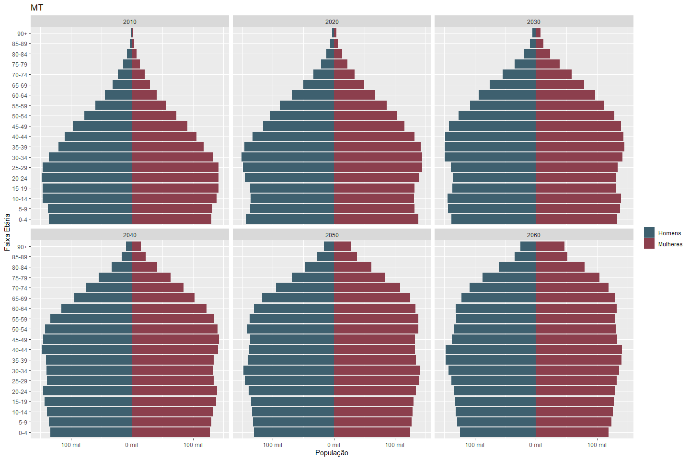
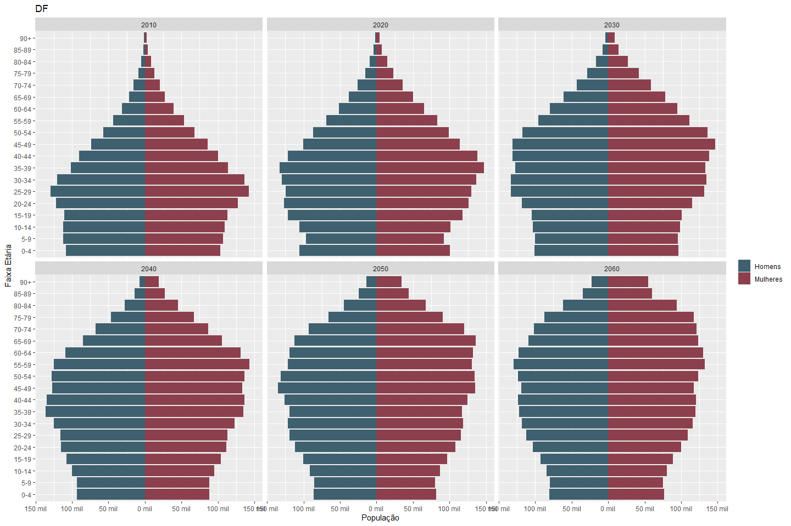

Pirâmides etárias do Brasil, regiões e estados utilizando a projeção
populacional do IBGE (2010-2060)
================
Leonardo Goes Shibata
23/10/2019

``` r
sheets <- excel_sheets("projecoes_2018_populacao_2010_2060.xls")[-1]

walk(sheets, plot_pyramid)
```

<!-- --><!-- --><!-- --><!-- --><!-- --><!-- --><!-- --><!-- --><!-- --><!-- --><!-- --><!-- --><!-- --><!-- --><!-- --><!-- --><!-- --><!-- --><!-- --><!-- --><!-- --><!-- --><!-- --><!-- --><!-- --><!-- --><!-- --><!-- --><!-- --><!-- --><!-- --><!-- --><!-- -->
