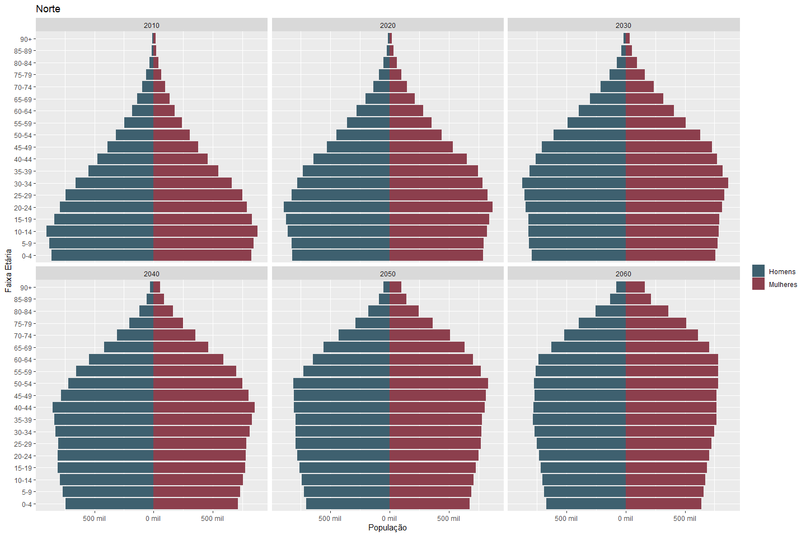
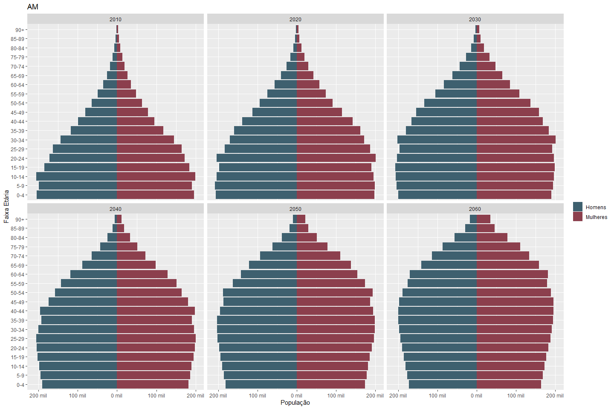
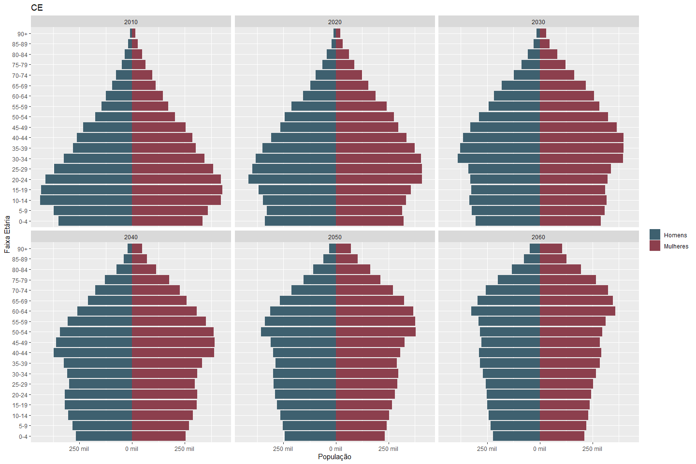
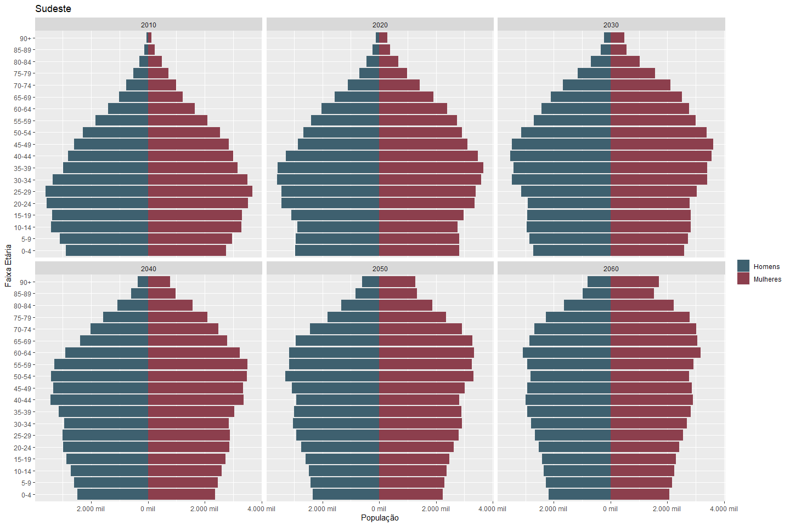
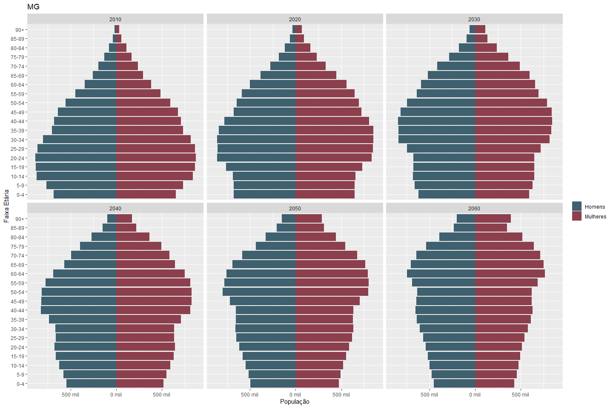
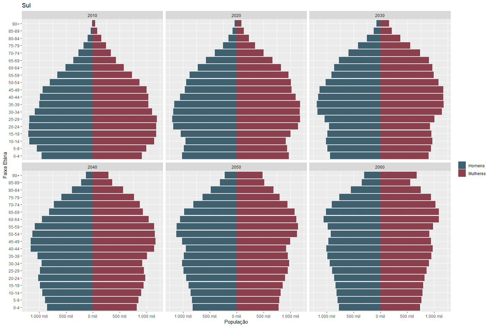
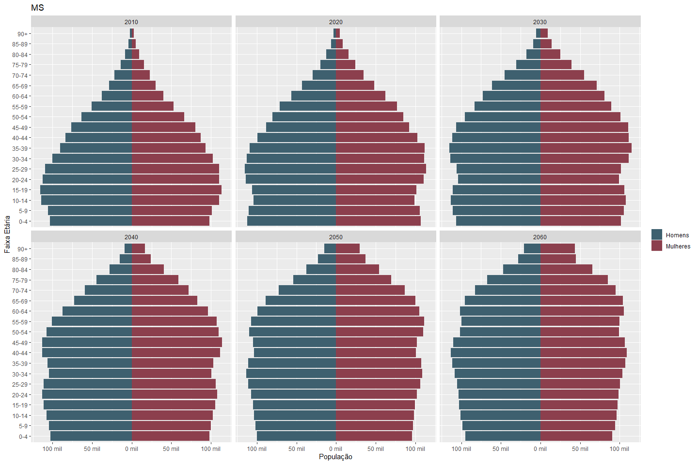
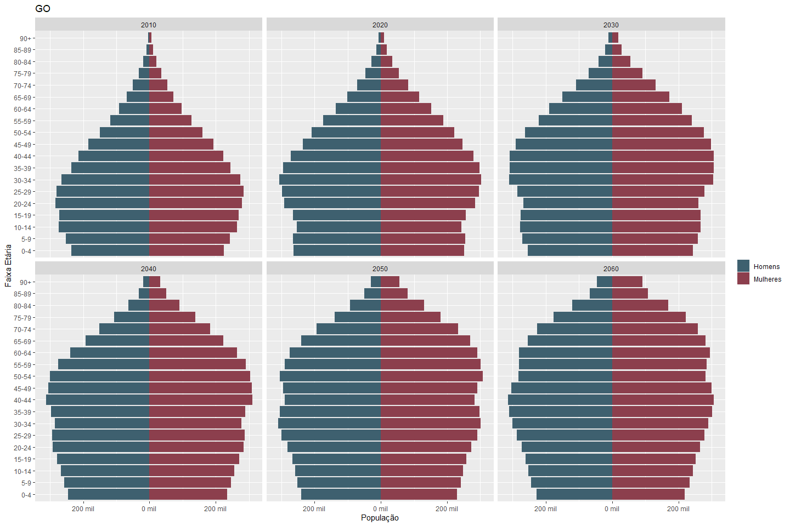

Pirâmides etárias do Brasil, regiões e estados utilizando a projeção
populacional do IBGE (2010-2060)
================
Leonardo Goes Shibata
23/10/2019

``` r
knitr::opts_chunk$set(echo = TRUE)

library(tidyverse) # R packages for data science
```

    ## -- Attaching packages ------------------------------------------------------------------------- tidyverse 1.2.1 --

    ## v ggplot2 3.2.1          v purrr   0.3.2     
    ## v tibble  2.1.3          v dplyr   0.8.3     
    ## v tidyr   1.0.0          v stringr 1.4.0     
    ## v readr   1.3.1.9000     v forcats 0.4.0

    ## -- Conflicts ---------------------------------------------------------------------------- tidyverse_conflicts() --
    ## x dplyr::filter() masks stats::filter()
    ## x dplyr::lag()    masks stats::lag()

``` r
library(readxl) # Read Excel Files
library(scales) # Scale Functions for Visualization
```

    ## 
    ## Attaching package: 'scales'

    ## The following object is masked from 'package:purrr':
    ## 
    ##     discard

    ## The following object is masked from 'package:readr':
    ## 
    ##     col_factor

``` r
# Download projeção da população
if (file.exists("projecoes_2018_populacao_2010_2060.xls") == FALSE) {
url <- "ftp://ftp.ibge.gov.br/Projecao_da_Populacao/Projecao_da_Populacao_2018/projecoes_2018_populacao_2010_2060.xls"
  download.file(url, destfile = "projecoes_2018_populacao_2010_2060.xls",
                mode = "wb")
}
```

``` r
absolute_format <- function(accuracy = 1, scale = 1, prefix = "",
                          suffix = "", big.mark = ".", decimal.mark = ",",
                          trim = TRUE, ...) {
  function(x) number(
      abs(x),
      accuracy = accuracy,
      scale = scale,
      prefix = prefix,
      suffix = suffix,
      big.mark = big.mark,
      decimal.mark = decimal.mark,
      trim = trim,
      ...
    )
}

plot_pyramid <- function(estado) {
  homens <- read_xls(path = "projecoes_2018_populacao_2010_2060.xls",
                     sheet = estado,
                     range = "A5:AZ25")
  
  mulheres <- read_xls(path = "projecoes_2018_populacao_2010_2060.xls",
                       sheet = estado,
                       range = "A28:AZ48")
  
  homens2 <- homens %>%
    pivot_longer(cols = -1, # all but the first
                 names_to = "ano",
                 values_to = "populacao") %>%
    filter(`GRUPO ETÁRIO`!="Total",
           ano %in% c("2010", "2020", "2030", "2040", "2050", "2060")) %>%
    mutate(faixa_etaria = factor(`GRUPO ETÁRIO`,
                                 levels = unique(`GRUPO ETÁRIO`),
                                 ordered = TRUE))
  
  mulheres2 <- mulheres %>%
    pivot_longer(cols = -1, # all but the first
                 names_to = "ano",
                 values_to = "populacao") %>%
    filter(`GRUPO ETÁRIO`!="Total",
           ano %in% c("2010", "2020", "2030", "2040", "2050", "2060")) %>%
    mutate(faixa_etaria = factor(`GRUPO ETÁRIO`,
                                 levels = unique(`GRUPO ETÁRIO`),
                                 ordered = TRUE))
  
  print(
    ggplot(data = homens2, aes(x = faixa_etaria, y = populacao)) +
    geom_col(data = homens2, aes(y = -populacao, fill = "Homens")) +
    geom_col(data = mulheres2, aes(fill = "Mulheres")) +
    coord_flip() +
    scale_y_continuous(labels = absolute_format(scale = 10^-3, suffix = " mil")) +
    facet_wrap("ano") +
    ggtitle(estado)
  )
}
```

``` r
sheets <- excel_sheets("projecoes_2018_populacao_2010_2060.xls")[-1]

walk(sheets, plot_pyramid)
```

<!-- --><!-- --><!-- --><!-- --><!-- --><!-- --><!-- --><!-- --><!-- --><!-- --><!-- --><!-- --><!-- --><!-- --><!-- --><!-- --><!-- --><!-- --><!-- --><!-- --><!-- --><!-- --><!-- --><!-- --><!-- --><!-- --><!-- --><!-- --><!-- --><!-- --><!-- --><!-- --><!-- -->
